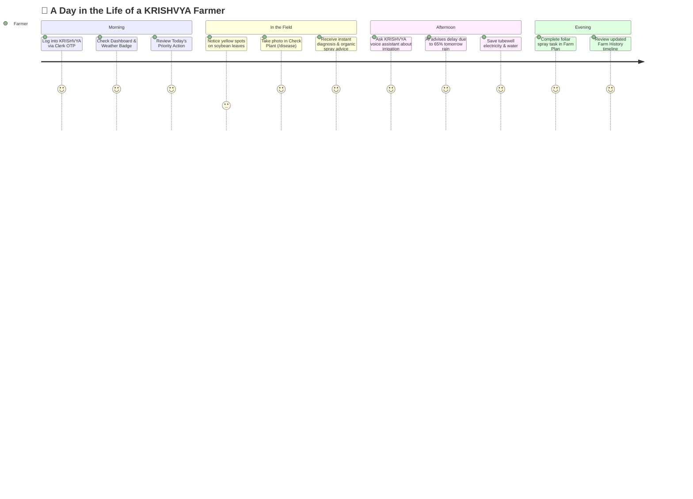
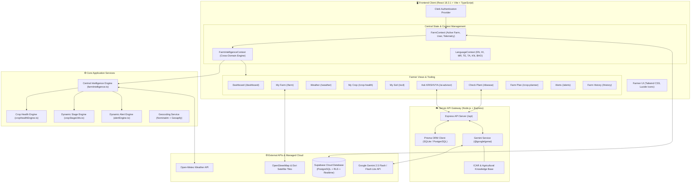
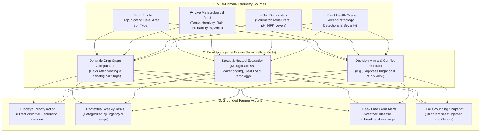
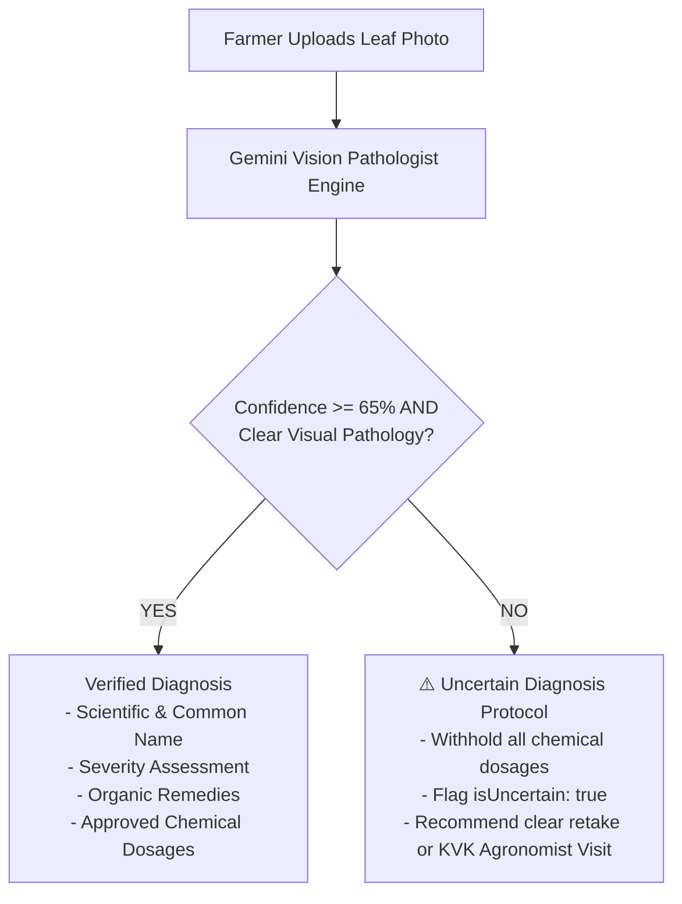
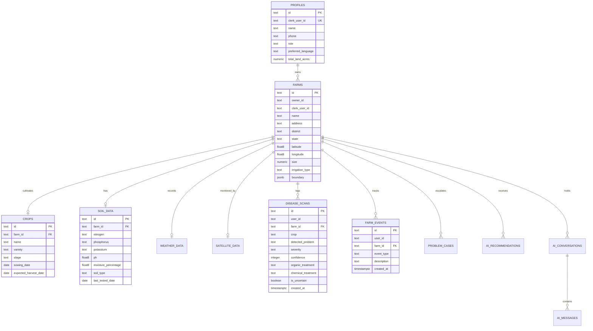

# 🌱 KRISHVYA — Your Farm. Your Data. Your AI.

> **"An AI-powered smart agriculture platform that helps farmers understand their farm, crop, soil and weather — and take better farming decisions."**

[](https://react.dev/)
[](https://www.typescriptlang.org/)
[](https://vitejs.dev/)
[](https://tailwindcss.com/)
[](https://supabase.com/)
[](https://clerk.com/)
[](https://ai.google.dev/)
[](https://open-meteo.com/)
[](https://leafletjs.com/)
[](https://opensource.org/licenses/MIT)

---

## 📑 Table of Contents

- [🌾 Overview](#-overview)
- [⚠️ The Problem in Indian Agriculture](#️-the-problem-in-indian-agriculture)
- [💡 The KRISHVYA Solution](#-the-krishvya-solution)
- [🎯 Core Philosophy & Principles](#-core-philosophy--principles)
- [🚀 Key Features & Modules](#-key-features--modules)
- [🗺️ Farmer Journey & Workflow](#️-farmer-journey--workflow)
- [🏛️ System Architecture](#️-system-architecture)
- [⚡ Central Farm Intelligence Engine](#-central-farm-intelligence-engine)
- [🤖 AI Architecture & Guardrails](#-ai-architecture--guardrails)
- [📊 Database Schema & Data Models](#-database-schema--data-models)
- [🔒 Security, Multi-Tenancy & RLS](#-security-multi-tenancy--rls)
- [🛠️ Tech Stack & Dependencies](#️-tech-stack--dependencies)
- [📁 Project Directory Structure](#-project-directory-structure)
- [⚙️ Environment Variables Setup](#️-environment-variables-setup)
- [💻 Installation & Local Development](#-installation--local-development)
- [🧪 Running Tests & Quality Verification](#-running-tests--quality-verification)
- [📱 End-to-End User Experience & Flow](#-end-to-end-user-experience--flow)
- [🌍 Multi-Language & Indian Localization Support](#-multi-language--indian-localization-support)
- [🛰️ Satellite & GIS Mapping Capabilities](#️-satellite--gis-mapping-capabilities)
- [📈 Real-World Impact & Hackathon Value](#-real-world-impact--hackathon-value)
- [🔮 Future Roadmap & Vision](#-future-roadmap--vision)
- [🤝 Contributing Guidelines](#-contributing-guidelines)
- [📄 License & Attribution](#-license--attribution)
- [👥 Team & Acknowledgements](#-team--acknowledgements)

---

## 🌾 Overview

**KRISHVYA** is an end-to-end Smart Agriculture Platform designed specifically for Indian farmers and smallholder producers. It bridges the gap between raw agronomic telemetry (multispectral satellite imagery, hyper-local meteorological forecasts, soil chemistry tests, and field observation data) and **farmer-friendly, plain-language operational decisions**.

Instead of presenting farmers with complex GIS dashboards, raw NDVI histograms, or abstract chemical indices, KRISHVYA synthesizes parcel data into answers to three fundamental questions:
1. **"How is my crop doing today?"**
2. **"What specific action do I need to take right now?"**
3. **"Why should I take this action, and what should I check before doing it?"**

---

## ⚠️ The Problem in Indian Agriculture

Smallholder agriculture in India faces severe structural bottlenecks:

- **Information Fragmentation**: Weather forecasts exist in one app, government soil health cards in paper booklets, pest advice in WhatsApp groups, and mandi prices elsewhere.
- **Cognitive Overload**: Modern ag-tech apps bombard farmers with satellite heatmaps, Normalized Difference Vegetation Indices (NDVI), and soil electrical conductivity without actionable context.
- **Hallucination & Misinformation Risk**: Generic generative AI chatbots frequently prescribe dangerous, unverified pesticide cocktails or invent chemical application rates when diagnosing plant pathology.
- **Language & Literacy Barriers**: Complex scientific terminology alienates rural farmers who need advice in conversational regional languages (Hindi, Marathi, Telugu, Tamil, Kannada, Bhojpuri).
- **Single-Source Isolation**: Lack of unified parcel context leads to irrigation right before unpredicted rainfall, wasting groundwater and tubewell electricity while causing root hypoxia.

---

## 💡 The KRISHVYA Solution

KRISHVYA solves these challenges with a **unified, cross-domain farm intelligence architecture**:

```
[Satellite Telemetry] + [Open-Meteo Weather] + [Soil Chemistry] + [Leaf Pathology]
                                    │
                                    ▼
                 ┌──────────────────────────────────────┐
                 │ KRISHVYA Farm Intelligence Engine    │
                 │ (Dynamic Cross-Domain Synthesis)     │
                 └──────────────────┬───────────────────┘
                                    │
       ┌────────────────────────────┼────────────────────────────┐
       ▼                            ▼                            ▼
🌟 Today's Priority Action    📅 Weekly Checklist         🤖 Grounded AI Advisor
"Delay tubewell watering;     "Foliar spray Boron 20%      "Ask KRISHVYA with 100%
 rain expected tomorrow"       at flowering stage"         farm context grounding"
```

1. **Farmer-First UX**: Clean, high-contrast, distraction-free visual design using natural agricultural tones (`#166534` Forest Green, `#EAF4EC` Soft Sage).
2. **Dynamic Grounding**: The AI assistant (`Ask KRISHVYA`) never operates in an isolated prompt; every recommendation is grounded in the farmer's registered parcel, live weather, crop stage, and soil moisture.
3. **Strict Data Integrity (Zero Fabrication)**: Telemetry is never mocked or hallucinated. Missing sensor data displays explicit status indicators (`"Telemetry Pending"`, `"Setup Needed"`) rather than fabricated numbers.
4. **Multimodal Pathology with Safety Gates**: Leaf disease detection using Google Gemini Vision with an automatic safety filter that refuses to prescribe toxic chemicals when an image is ambiguous or blurry.

---

## 🎯 Core Philosophy & Principles

| Principle | KRISHVYA Implementation |
| :--- | :--- |
| **Grounded in Reality** | Every recommendation checks real parcel data (sowing date, crop, location, weather). |
| **Zero Fabrication** | No hardcoded scores or fake NDVI data. If telemetry is missing, we clearly guide the farmer on how to provide it. |
| **Safety First** | Pathogen scans with confidence < 65% or ambiguous features trigger an `"Uncertain Diagnosis"` safety protocol with zero chemical dosages. |
| **Farmer-Accessible Language** | Technical jargon is translated into conversational dialect (e.g., "Crown Root Initiation" → "शुरुआती जड़ विकास अवस्था"). |
| **Actionable over Analytical** | Convert data into plain directives: *What to do*, *Why to do it*, and *What to check*. |

---

## 🚀 Key Features & Modules

### 1. 📊 Farm Dashboard (`/dashboard`)
- **Today on My Farm**: Instant summary of current crop stage, days after sowing (DAS), and primary field condition.
- **Priority Farm Action**: Dynamic single-priority action for the day (e.g., irrigation timing, nutrient application).
- **Live Meteorological Badge**: Real-time temperature, condition icon, precipitation probability, and wind metrics.
- **Quick Links**: One-tap access to scan leaves, ask the AI advisor, or review upcoming tasks.

### 2. 🌱 My Farm Profile & GIS Map (`/farm`)
- **Digital Farm Profile**: Parcel name, surveyed area (acres/hectares), soil categorization, and irrigation system.
- **Interactive Satellite Map**: Leaflet-powered GIS viewer featuring OpenStreetMap and high-resolution Esri World Imagery.
- **Boundary Polygon Tool**: Allows farmers to record and adjust GPS field boundaries with vertex snapping and centroid geocoding.
- **Multi-Farm Selector**: Farmers with multiple land parcels can seamlessly switch between fields from the top navigation bar.

### 3. 🌦️ Weather & Spray Advisory (`/weather`)
- **Hyper-Local Meteorological Telemetry**: Direct integration with the Open-Meteo API using exact farm GPS coordinates.
- **Hourly Spray Window Analyzer**: Determines safe spraying hours by evaluating wind speed (< 15 km/h) and rain probability (< 30%).
- **7-Day Agronomic Forecast**: Day-by-day temperature highs/lows, rain forecasts, and expected field impact.
- **"What This Weather Means"**: Translates atmospheric metrics into concrete irrigation, spraying, and fieldwork advice.

### 4. 🌿 My Crop & Growth Stage (`/crop-health`)
- **Dynamic Days-After-Sowing (DAS) Engine**: Automatically computes physiological crop growth stages (Seedling, Vegetative, Flowering, Pod Development, Maturity) based on recorded sowing dates.
- **Vegetation Status & Canopy Vigor**: Synthesizes crop stage and moisture levels to report vigor without confusing raw telemetry numbers.
- **Stress Detection & Root Causes**: Correlates high temperature anomalies or moisture deficits with active leaf pathology scans.

### 5. 💧 My Soil Health (`/soil`)
- **Macronutrient Tracking**: Monitors Soil Health Card readings for Nitrogen (N), Phosphorus (P), and Potassium (K).
- **Soil Chemistry Gauges**: Calibrated display of soil pH, Volumetric Soil Moisture percentage, and Organic Carbon (SOC).
- **Crop-Specific Soil Suitability**: Explains whether the parcel's soil profile matches the selected crop's physical and biological requirements.
- **Historical Soil Logs**: Log new laboratory test reports or digital soil probe measurements.

### 6. 🤖 Ask KRISHVYA — AI Farm Advisor (`/ai-advisor`)
- **Context-Grounded Conversational AI**: Powered by Google Gemini 2.5 Flash / Flash Lite via `@google/genai`.
- **Automatic Farm Context Injection**: Every query injects crop, location, soil pH, moisture, and live forecast into the system instructions.
- **Multi-Language Support**: Answers fluently in English, Hindi (हिंदी), Marathi (मराठी), Telugu (తెలుగు), Tamil (தமிழ்), Kannada (ಕನ್ನಡ), and Bhojpuri (भोजपुरी).
- **Speech-to-Text & Text-to-Speech**: Integrated browser voice recognition and speech synthesis for effortless hands-free field usage.

### 7. 🔬 Check Plant — Multimodal Pathology Scanner (`/disease`)
- **Vision-Based Leaf Diagnosis**: Farmers capture or upload photos of symptomatic leaves directly from mobile or desktop.
- **Multimodal AI Analysis**: Analyzes leaf lesions, chlorosis patterns, and fungal structures using Gemini Vision models.
- **Agronomic Safety Protocol**: Categorizes diagnoses into *High Confidence* or *Uncertain*. Uncertain scans withhold chemical dosages to protect crops and soil health.
- **Dual Treatment Protocols**: Provides both biological/organic remedies (e.g., Neem oil, Trichoderma viride) and verified chemical treatments with application precautions.
- **Agronomist Escalation**: Option to send uncertain scans to Krishi Vigyan Kendra (KVK) agronomists for review.

### 8. 📅 Farm Plan & Weekly Checklist (`/crop-planner`)
- **Weekly Operations Schedule**: Actionable calendar of upcoming field activities categorized by urgency (*Urgent*, *Routine*, *Upcoming*).
- **One-Click Completion Tracking**: Farmers mark tasks as done, automatically persisting logs into `farm_events`.
- **Dynamic Schedule Adjustments**: Automatically adapts when rain is forecast or irrigation has been completed.

### 9. 🔔 Attention Center & Alerts (`/alerts`)
- **Real-Time Hazard Feed**: Aggregates urgent alerts regarding incoming weather events (storms, heatwaves), pathogen outbreaks, or moisture deficits.
- **Action-Oriented Cards**: Each alert pairs the warning with a concrete step (e.g., *"Clear drainage perimeter ditches within 24 hours"*).
- **Dynamic Farm Scoping**: Automatically filters alerts relevant only to the currently selected farm parcel and district.

### 10. 📜 Farm History & Audit Trail (`/history`)
- **Chronological Field Timeline**: Unified historical record of all farm events—irrigation cycles, sowing dates, soil test submissions, and disease scans.
- **Traceable Agronomic Log**: Helps farmers audit previous treatments and track seasonal progress over years.

### 11. 🧪 Specialized Utilities
- **Tank Mix Calculator (`/tank-calculator`)**: Calculates precise chemical dilutions, water-to-chemical ratios, and spray tank capacity to prevent crop burn.
- **Regenerative Agriculture Hub (`/regenerative`)**: Guidance on cover cropping, biochar, minimum tillage, and organic carbon sequestration.
- **What-If Scenario Simulator (`/what-if`)**: Simulates the agronomic and financial impact of rainfall delays, fertilizer adjustments, or heat waves.
- **BRICS Agriculture Hub (`/brics`)**: Knowledge repository comparing cropping practices and sustainable techniques across BRICS member states.
- **Agronomist Triage Portal (`/expert/dashboard`)**: Dedicated agronomist view to review escalated problem cases and provide certified feedback.

---

## 🗺️ Farmer Journey & Workflow



---

## 🏛️ System Architecture

KRISHVYA follows a modern, decoupled cloud architecture designed for high availability, low latency, and zero data leakage between tenants.



---

## ⚡ Central Farm Intelligence Engine

The heart of KRISHVYA's operational intelligence is `src/services/farmIntelligence.ts`. This engine synthesizes disjointed agricultural metrics into clear, non-contradictory farm decisions.



### Decision Matrix Logic Examples:
- **Rain vs. Irrigation**: If rain probability is > 40% or recent precipitation occurred, irrigation recommendations are paused to protect roots from hypoxia and conserve water.
- **Wind vs. Chemical Spraying**: If wind speed exceeds 15 km/h, all foliar spraying activities are placed on hold to prevent chemical drift.
- **Disease Isolation**: When an active `High` or `Critical` disease scan is detected, the priority action shifts immediately to disease containment before routine fertilizing.

---

## 🤖 AI Architecture & Guardrails

KRISHVYA utilizes the official `@google/genai` SDK with Google Gemini 2.5 Flash and Gemini Flash Lite models.

### 1. Grounded Context Injection (`Ask KRISHVYA`)
The AI advisor never generates generic answers. Every prompt is wrapped with a strict system instruction containing the active farm snapshot:
```markdown
Farmer & Farm Context (Source of Truth):
- Farmer Name: Ramesh Patel
- Farm Name: Soybean Field #1 (2.5 acres, Nagpur, Maharashtra)
- Crop: Soybean (Stage: Flowering, Sown: 2024-06-15, 75 DAS)
- Soil: Loamy Black Cotton, pH: 6.8, Moisture: 42%
- Live Weather: Temp: 28°C, Partly Cloudy, Rain Prob: 60%, Wind: 12 km/h
- Today's Priority Recommendation: Delay irrigation today; rain expected tomorrow.
- Verified Agricultural Knowledge Base: ICAR-IISR Soybean Guidelines & SoilGrids
```

### 2. Pathological Uncertainty Safety Filter (`Check Plant`)
To prevent agrochemical poisoning and crop destruction caused by AI hallucination, KRISHVYA enforces a strict plant pathology safety protocol in `server/src/services/geminiService.ts`:



---

## 📊 Database Schema & Data Models

KRISHVYA supports dual database persistence:
1. **Production Cloud Database**: Supabase PostgreSQL with Row Level Security (RLS) and Realtime WebSocket replication.
2. **Local Development Gateway**: Prisma ORM with SQLite for zero-config local testing.

### Core Tables & Relations (Supabase / PostgreSQL)



---

## 🔒 Security, Multi-Tenancy & RLS

Data privacy is paramount in agricultural technology. Farmers must have complete ownership and privacy over their land boundaries, soil chemistry, and yield estimates.

- **Authentication**: Managed via Clerk (`@clerk/clerk-react`), supporting phone OTP, social logins, and passwordless authentication.
- **Third-Party JWT Integration**: Clerk User IDs (`user_...`) are mapped directly to Supabase authentication tokens.
- **Row-Level Security (RLS)**: Every database query executes with PostgreSQL RLS policies ensuring farmers can only read and mutate their own parcels:

```sql
-- RLS Farm Isolation Example
CREATE POLICY "Users can read own farms" ON public.farms 
  FOR SELECT USING (
    clerk_user_id = coalesce(auth.jwt() ->> 'sub', clerk_user_id) 
    OR owner_id = coalesce(auth.jwt() ->> 'sub', owner_id)
  );

CREATE POLICY "Users can modify own farms" ON public.farms 
  FOR ALL USING (
    clerk_user_id = coalesce(auth.jwt() ->> 'sub', clerk_user_id) 
    OR owner_id = coalesce(auth.jwt() ->> 'sub', owner_id)
  );
```

---

## 🛠️ Tech Stack & Dependencies

### Frontend Architecture
- **Framework**: React 18.3.1
- **Language**: TypeScript 5.5.3
- **Build Tool**: Vite 5.4.3
- **Styling**: Tailwind CSS 3.4.11
- **Icons**: Lucide React 1.16.0
- **GIS & Mapping**: Leaflet 1.9.4 & OpenStreetMap
- **Authentication**: `@clerk/clerk-react` 5.61.9
- **Cloud Database Client**: `@supabase/supabase-js` 2.116.0
- **Routing**: `react-router-dom` 6.26.2

### Backend API Server
- **Runtime**: Node.js (ES Modules) + `tsx` / TypeScript 5.5.4
- **Web Framework**: Express 4.21.0
- **AI Engine**: `@google/genai` 2.22.0 (Google Gemini 2.5 Flash / Flash Lite)
- **Local ORM**: Prisma 6.19.3
- **Security & Headers**: CORS 2.8.5, JSON Web Token 9.0.3, BCrypt.js 3.0.3

### External APIs & Data Sources
- **Live Weather**: Open-Meteo High-Resolution Forecast & Radar API (Free, zero-key)
- **Geocoding**: OpenStreetMap Nominatim & Geoapify
- **Satellite Imagery**: Esri World Imagery & ESA Copernicus Sentinel-2 MSI

---

## 📁 Project Directory Structure

```
krishvya/
├── index.html                      # Root HTML container
├── package.json                    # Frontend dependencies & scripts
├── tsconfig.json                   # TypeScript compiler configuration
├── tailwind.config.js              # Agricultural color palette configuration
├── vite.config.ts                  # Vite bundler & plugin setup
├── .env.example                    # Frontend environment template
│
├── public/                         # Static assets, logos, and icons
│
├── src/                            # Frontend application source code
│   ├── App.tsx                     # Top-level Clerk & Context provider wrapper
│   ├── main.tsx                    # React DOM entrypoint
│   ├── components/                 # Reusable UI components & layouts
│   │   ├── Navigation.tsx          # Farmer-first sidebar & bottom navigation
│   │   ├── DynamicCropStageBadge.tsx # DAS & physiological stage pill
│   │   ├── WeatherCard.tsx         # Live meteorological card
│   │   └── ...
│   ├── context/                    # Central React State Contexts
│   │   ├── FarmContext.tsx         # Active farm, user profiles, parcel state
│   │   ├── FarmIntelligenceContext.tsx # Central intelligence synthesis provider
│   │   └── LanguageContext.tsx     # 7-language localization provider
│   ├── data/                       # Static agronomic datasets & reference constants
│   ├── i18n/                       # Localization dictionaries (HI, MR, TE, TA, etc.)
│   ├── pages/                      # Application route pages
│   │   ├── LandingPage.tsx         # Public landing page
│   │   ├── DashboardPage.tsx       # Daily farm overview & priority action
│   │   ├── FarmPage.tsx            # Digital farm profile & GIS boundary map
│   │   ├── WeatherPage.tsx         # Live weather forecast & spray windows
│   │   ├── CropHealthPage.tsx      # Crop stage, vegetation vigor & stress analysis
│   │   ├── SoilHealthPage.tsx      # Soil nutrients, pH & moisture tracking
│   │   ├── AiAdvisorPage.tsx       # Ask KRISHVYA conversational assistant
│   │   ├── DiseaseDoctorPage.tsx   # Check Plant leaf pathology scanner
│   │   ├── CropPlannerPage.tsx     # Dynamic weekly farm plan checklist
│   │   ├── AlertsPage.tsx          # Real-time attention center & advisories
│   │   ├── HistoryPage.tsx         # Chronological farm audit trail & events
│   │   ├── TankCalculatorPage.tsx  # Agrochemical dilution calculator
│   │   └── ...
│   ├── routes/                     # React Router configurations & protected routes
│   │   └── AppRoutes.tsx           # Route declarations with lazy loading
│   ├── services/                   # Frontend service clients
│   │   ├── farmIntelligence.ts    # Central farm intelligence synthesis engine
│   │   ├── cropHealthEngine.ts     # Crop stage & vigor evaluation
│   │   ├── alertEngine.ts          # Real-time alert generation
│   │   ├── geocodingService.ts     # OSM Nominatim geocoding client
│   │   ├── supabaseService.ts      # Supabase cloud data client & sync
│   │   └── voiceService.ts         # Hands-free speech recognition & synthesis
│   └── utils/                      # Helper utilities (date parsing, stage math)
│
├── server/                         # Backend API gateway & Gemini AI service
│   ├── package.json                # Backend dependencies
│   ├── prisma/
│   │   └── schema.prisma           # Prisma database schema definition
│   └── src/
│       ├── index.ts                # Express server entrypoint (Port 5001)
│       ├── db.ts                   # Database connection manager
│       ├── middleware/             # Authentication & tenant middleware
│       ├── routes/                 # Express API routes
│       │   ├── aiRoutes.ts         # Gemini AI chat & leaf diagnosis endpoints
│       │   ├── farmRoutes.ts       # Parcel management endpoints
│       │   ├── weatherRoutes.ts    # Open-Meteo proxy routes
│       │   └── ...
│       └── services/
│           └── geminiService.ts    # Google GenAI SDK integration & guardrails
│
└── supabase/                       # Supabase cloud database scripts
    ├── config.toml                 # Local Supabase CLI configuration
    ├── schema.sql                  # Complete PostgreSQL table definitions & RLS
    └── rls_policies.sql            # Dedicated security & row isolation policies
```

---

## ⚙️ Environment Variables Setup

### 1. Frontend Configuration (`/.env`)

Copy the template from `.env.example`:
```bash
cp .env.example .env
```

Configure the following variables in `.env`:

| Variable | Description | Source |
| :--- | :--- | :--- |
| `VITE_CLERK_PUBLISHABLE_KEY` | Clerk Authentication Publishable Key | [Clerk Dashboard](https://dashboard.clerk.com) |
| `VITE_SUPABASE_URL` | Supabase Project URL | [Supabase Dashboard](https://app.supabase.com) |
| `VITE_SUPABASE_PUBLISHABLE_KEY` | Supabase Anon/Publishable API Key | [Supabase Dashboard](https://app.supabase.com) |
| `VITE_GEOCODING_API_KEY` | *(Optional)* Geoapify or LocationIQ Key | Auto-falls back to OpenStreetMap Nominatim |

### 2. Backend Configuration (`/server/.env`)

Configure the following in `server/.env`:

| Variable | Description | Source |
| :--- | :--- | :--- |
| `PORT` | API Server Port (Default: `5001`) | Local environment |
| `GEMINI_API_KEY` | Google Gemini API Key | [Google AI Studio](https://aistudio.google.com/) |
| `DATABASE_URL` | SQLite / PostgreSQL Connection String | Local file or cloud instance |

---

## 💻 Installation & Local Development

### Prerequisites
- **Node.js**: v18.0.0 or higher
- **npm**: v9.0.0 or higher
- **Git**

### Step-by-Step Setup

```bash
# 1. Clone the repository
git clone https://github.com/your-username/krishvya.git
cd krishvya

# 2. Install Frontend Dependencies
npm install

# 3. Install Backend Server Dependencies
cd server
npm install
cd ..

# 4. Configure Environment Variables
cp .env.example .env
# Edit .env with your Clerk and Supabase credentials
# Create server/.env with your GEMINI_API_KEY

# 5. Initialize the Local Database (Optional - for local SQLite testing)
cd server
npm run prisma:generate
npm run prisma:push
cd ..
```

### Running the Development Environment

Open two terminal windows:

**Terminal 1 — Backend Gateway & AI Service:**
```bash
cd server
npm run dev
# Server starts on http://localhost:5001
```

**Terminal 2 — Frontend Application:**
```bash
npm run dev
# Vite dev server starts on http://localhost:5173
```

Open your browser and navigate to **`http://localhost:5173`**.

---

## 🧪 Running Tests & Quality Verification

KRISHVYA includes production build verification and TypeScript type checking:

```bash
# Run TypeScript compilation and build production bundle
npm run build

# Preview production build locally
npm run preview
```

---

## 📱 End-to-End User Experience & Flow

```
1. Onboarding
   ├── Farmer signs in via Clerk OTP / Email
   ├── Enters farm name, location, and parcel acreage
   └── Sets crop type (e.g. Soybean) and sowing date
          │
          ▼
2. Daily Engagement
   ├── Views Dashboard: "Today on My Farm"
   ├── Checks hyper-local weather & rain probability
   └── Reads "Today's Farm Action" before starting field work
          │
          ▼
3. Field Diagnostics & AI Support
   ├── Identifies suspicious leaf symptoms using Check Plant (/disease)
   ├── Receives high-confidence organic treatment plan
   └── Chats with Ask KRISHVYA (/ai-advisor) in Hindi/English
          │
          ▼
4. Operations & Audit
   ├── Completes irrigation & marks task done in Farm Plan (/crop-planner)
   └── Inspects historical events in Farm History (/history)
```

---

## 🌍 Multi-Language & Indian Localization Support

KRISHVYA is built from the ground up for linguistic accessibility. The entire interface, navigation, and AI responses dynamically adapt to:

| Language | Code | Native Script |
| :--- | :--- | :--- |
| **English** | `en` | English |
| **Hindi** | `hi` | हिन्दी |
| **Marathi** | `mr` | मराठी |
| **Telugu** | `te` | తెలుగు |
| **Tamil** | `ta` | தமிழ் |
| **Kannada** | `kn` | ಕನ್ನಡ |
| **Bhojpuri** | `bho` | भोजपुरी |

### Regional Agronomic Translation Engine
Our system prompt instructs Gemini to use natural agricultural terminology instead of awkward literal translations:
- *"Flowering stage"* → *"फूल आने की अवस्था"*
- *"Vegetative stage"* → *"बढ़वार की अवस्था"*
- *"Irrigation"* → *"सिंचाई"*
- Standard fertilizer abbreviations (*DAP, Urea, MOP*) are preserved in familiar farmer notation.

---

## 🛰️ Satellite & GIS Mapping Capabilities

KRISHVYA integrates geospatial tools directly into the farmer's workflow without overwhelming technical complexity:

- **Interactive Parcel Boundary Tracing**: Leaflet map interface allows farmers to outline their exact plot boundaries using standard polygon tools.
- **Centroid Computation**: Automatically calculates parcel center coordinates (lat, lng) to anchor hyper-local meteorological queries.
- **Satellite Baselayers**: Seamlessly toggle between OpenStreetMap street/cadastral views and Esri World Satellite Imagery for visual field boundary verification.
- **Copernicus Sentinel-2 Readiness**: Prepared schema and API endpoints for Sentinel-2 multispectral vegetation index layers (NDVI, NDWI, EVI).

---

## 📈 Real-World Impact & Hackathon Value

| Metric / Dimension | Traditional Scenario | With KRISHVYA |
| :--- | :--- | :--- |
| **Water & Energy Wastage** | Farmers irrigate blindly, only for rain to flood fields hours later. | Rain-aware advisory delays tubewell pumping, saving thousands of liters of groundwater and grid electricity. |
| **Agrochemical Overuse** | Farmers apply broad-spectrum toxic chemicals for minor leaf spots. | Strict AI safety gates recommend targeted organic remedies first and withhold unverified dosages. |
| **Crop Yield Preservation** | Pests go unnoticed until infestation exceeds economic injury levels. | Early leaf scanning catches fungal/bacterial blight in initial stages. |
| **Digital Literacy Barrier** | Farmers struggle with technical English dashboards. | Voice-enabled conversational AI in 7 regional languages speaks the farmer's dialect. |

---

## 🔮 Future Roadmap & Vision

- [ ] **Offline-First PWA & IndexedDB Sync**: Complete local offline caching for remote farm regions with zero cellular reception.
- [ ] **Automated Satellite NDVI Ingestion**: Direct cloud pipeline with Sentinel-Hub / Google Earth Engine for automated weekly vegetative vigor alerts.
- [ ] **IoT LoRaWAN Soil Probe Integration**: Direct telemetry streaming from field-installed capacitive soil moisture and temperature probes.
- [ ] **Mandi Price Intelligence**: Live commodity pricing forecasts across APMC mandis to recommend optimal harvest and marketing windows.
- [ ] **KVK Agronomist Collaborative Portal**: Complete bidirectional video and prescription chat between farmers and certified agronomists.

---

## 🤝 Contributing Guidelines

We welcome contributions from agronomists, software engineers, and agricultural enthusiasts!

1. **Fork the Repository**
2. **Create a Feature Branch**:
   ```bash
   git checkout -b feature/AmazingAgronomyFeature
   ```
3. **Commit your Changes**:
   ```bash
   git commit -m "Add dynamic soil moisture threshold for Cotton"
   ```
4. **Push to Branch**:
   ```bash
   git push origin feature/AmazingAgronomyFeature
   ```
5. **Open a Pull Request**

Please ensure all TypeScript types compile (`npm run build`) before opening a pull request.

---

## 📄 License & Attribution

This project is licensed under the **MIT License** — see the [LICENSE](LICENSE) file for details.

### Agricultural Knowledge Attribution
Agronomic datasets, fertilizer schedules, and disease management guidelines are compiled from:
- **ICAR** (Indian Council of Agricultural Research)
- **KVK** (Krishi Vigyan Kendra) extension publications
- **data.gov.in** Open Agricultural Datasets
- **FAOSTAT** (Food and Agriculture Organization of the United Nations)
- **SoilGrids** (ISRIC World Soil Information)

---

## 👥 Team & Acknowledgements

Developed with ❤️ for the farmers who feed our nation.

- **Lead Developer & Architect**: Saurabh Singh
- **Special Thanks**: Indian agricultural scientists, open-source contributors, and the Google Gemini & Supabase developer communities.

---

<div align="center">
  <sub>🌱 <b>KRISHVYA</b> — Empowering Indian agriculture through data-driven intelligence.</sub>
</div>
